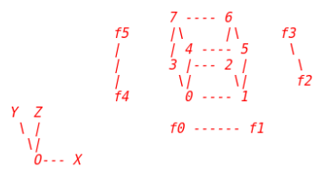

---
yaml fr matter
---

asdfsdf

# this is a caption

## second caption

math $a=16x+12^5$ d

dsd sd~2~sdf b и еще на русском $S_{вз}=16\ м^3$

asdf [^11]

------

$$
a=16mx^2
$$

$$
d=3
$$
$ 3=5^2 $ where $a=b$ and $x$ 

Lorem ipsum dolor sit amet, consectetur adipiscing elit. Duis quis tincidunt dolor, sed scelerisque tellus. Nullam feugiat consequat interdum. Maecenas ut porttitor ante. Etiam posuere auctor porttitor. Sed id rutrum purus, vel ultricies diam. Mauris malesuada purus vel suscipit convallis. Mauris a nisl ac sem aliquet posuere.

Mauris placerat sapien ut elementum viverra. Integer lobortis aliquam vulputate. Proin sed mauris vitae magna porttitor mattis sed eu odio. Sed dignissim, tellus ac molestie interdum, massa mauris convallis nulla, vitae porta diam ipsum at urna. Donec fermentum, purus a finibus aliquam, purus mi tincidunt dui, sit amet venenatis justo ligula in lectus. Vivamus interdum augue at sagittis mollis. Cras ut odio vel mi fermentum tempus nec non diam. Sed iaculis metus in risus hendrerit efficitur. Donec a elit ac nisi porttitor efficitur.

Pellentesque lobortis ipsum leo, nec gravida sapien consequat at. Aliquam semper, elit a aliquam sollicitudin, mi ex facilisis magna, quis semper est libero ac ligula. Donec volutpat vel ante sed congue. Cras tincidunt, urna non pretium ullamcorper, eros risus pretium quam, id cursus justo nisl id tellus. Sed in interdum lectus, nec aliquet nunc. Donec maximus erat sed accumsan mattis. Ut a massa in dui scelerisque vehicula. Nunc diam dolor, mollis cursus iaculis at, semper non nisl.

Cras scelerisque vel augue sed sagittis. Donec laoreet lacinia mi sed porttitor. Class aptent taciti sociosqu ad litora torquent per conubia nostra, per inceptos himenaeos. Vivamus elementum, dui quis ullamcorper consectetur, velit mi aliquet tortor, sed pretium leo velit et elit. Proin auctor ipsum sed nisi venenatis, eget porta lacus finibus. In laoreet vel est sit amet scelerisque. Fusce tempus egestas nisl.

Mauris placerat dictum dictum. Pellentesque habitant morbi tristique senectus et netus et malesuada fames ac turpis egestas. Proin imperdiet semper feugiat. In volutpat, massa consequat lacinia dictum, enim nunc consequat orci, at ornare lacus dolor vel metus. Ut bibendum varius diam, vitae elementum tellus congue non. In laoreet elit nec tellus placerat, in feugiat ligula pharetra. Donec dignissim massa sem, sit amet elementum neque condimentum eget. Maecenas ac quam non arcu dignissim interdum. Integer finibus feugiat nulla sit amet vestibulum. Nullam eget vulputate metus. Sed metus leo, porta quis libero a, suscipit vestibulum orci. Mauris non ultricies lacus, vitae rhoncus ex. Duis ut orci eu turpis dignissim posuere eget congue ex. In hac habitasse platea dictumst. Nam sit amet cursus nibh. Integer at magna pharetra, suscipit erat a, suscipit sem.

[TOC]

d

| sdf  | sdfvdf | sdfv | dff  | fdf  |
| ---- | ------ | ---- | :--: | :--: |
|      |        |      |  v   |  v   |
|      |        |      |      |      |
|      |        |      |  v   |      |
|      |        |      |  v   |      |

[^11]: xczxcsssss

